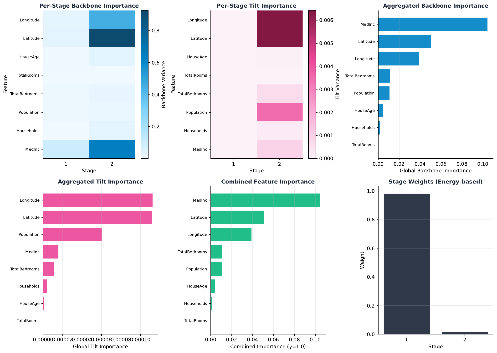
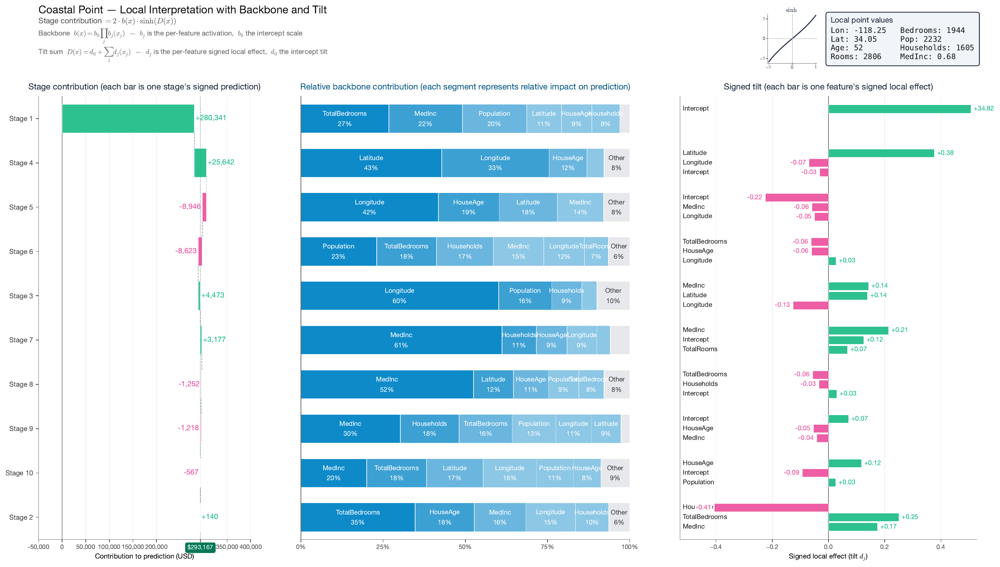
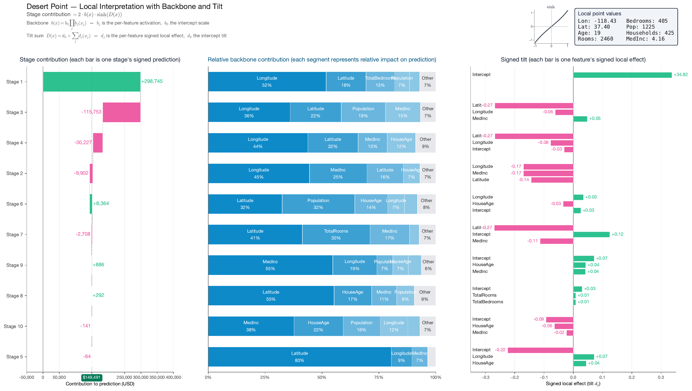
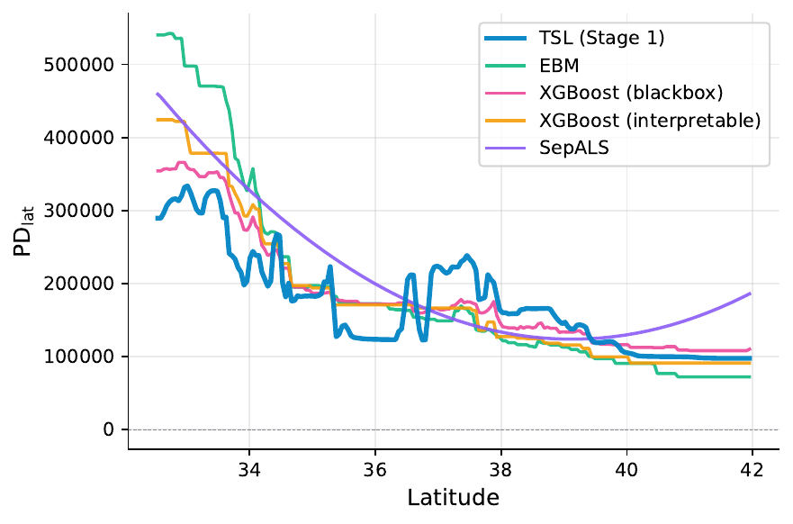
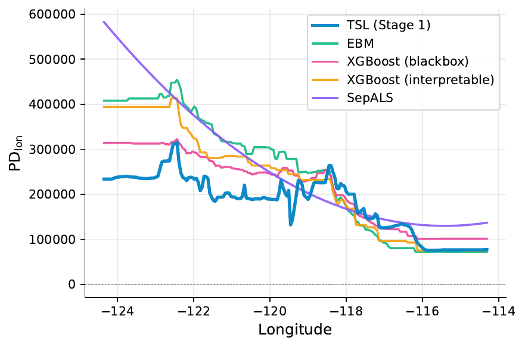

<h1 align="center">
  <br>
  TSL — Tensor Separation Learning
</h1>

<p align="center">
  <a href="https://opensource.org/licenses/MIT"></a>
</p>

**TSL** is a glass-box regression model that fits a sum of *separable
stages*, each a difference of two products of one-variable functions.
Unlike additive models (GAMs, EBM, GA²M), which build up interactions one
low-dimensional shape function at a time, a single TSL stage binds all
features together through its rank-1 products — and remains fully
inspectable, since every factor is a 1D function whose effect can be read
off directly.

## Examples

The diagnostics below come from the scripts in
[`tsl-py/examples/`](tsl-py/examples/); PDF originals live in
[`tsl-py/examples/figures/`](tsl-py/examples/figures/) and the full set with
regeneration commands is in the
[examples README](tsl-py/examples/README.md).

### California housing

A 2-stage TSL fit on the OpenML California housing dataset (target: median
home value, USD). The two stages decompose cleanly into a **coastal premium**
(Stage 1) and an **inland correction** (Stage 2).

#### Spatial backbone and 2D partial dependence

Each stage is a product of 1D factors, so its 2D PD over (longitude, latitude)
is the product of the corresponding 1D factors (up to a scalar). The
*magnitude* of that product — the **backbone** of the stage — acts as a
spatial gate: where the backbone is near zero, the stage is silent.


*Top row:* backbone (magnitude). *Bottom row:* signed 2D PD in USD. Stage 1
fires along the coast — its 1D factors peak at longitudes near LA and SF and
at the Bay Area latitude — encoding the coastal premium. Because the stage is
separable, the product also over-predicts at any point that falls in *both* a
longitude peak *and* a latitude peak, including low-density inland regions
(desert valleys). Stage 2's backbone gates onto exactly those inland regions
and supplies a negative correction that cancels the artifact.

#### Feature importance

<p align="center">
  
</p>

Per-stage importances aggregated across stages. Geography (Longitude,
Latitude) dominates, with the Stage-2 inland correction loaded primarily onto
longitude.

#### Local explanations

The prediction at a single point is a sum of *stage contributions*, each of
which factorizes as **magnitude × signed direction**. The 3-panel diagnostic
shows, for each stage, (i) the dollar contribution per stage, (ii) the share
of each feature in that stage's magnitude, and (iii) the signed direction of
each feature within the stage.

A **coastal** observation (LA-area, predicted ≈ \$293k):



A **desert** observation (low-density inland, predicted ≈ \$149k):



In the desert panel, Stage 1's spatial gate collapses (the longitude factor
is near zero) and the coastal premium does not fire. Stage 2's backbone is
large here and contributes the negative correction predicted by the spatial
figure above. This is the local view of the global division of labour between
the two stages.

#### 1D PD comparison vs. EBM, XGBoost, SepALS

<p align="center">
  
  
</p>

1D partial dependence on Latitude (left) and Longitude (right) for TSL
(Stage 1), EBM, XGBoost at the interpretable and black-box depth regimes, and
[SepALS](https://github.com/jyliuu/sepals). EBM and tree models express geography through a joint
$(\mathrm{lat}, \mathrm{lon})$ surface, so the marginal PD on one coordinate
averages over the other and smooths away localized peaks. TSL's stage factor
is itself a 1D function, so its PD has no marginalization-induced smoothing
and retains the sharp local structure near LA, SF, and the Bay Area.

## Installation

### Rust

1. Install Rust via [rustup](https://rustup.rs/):
   ```sh
   curl --proto '=https' --tlsv1.2 -sSf https://sh.rustup.rs | sh
   ```
2. Clone and build:
   ```sh
   git clone https://github.com/jyliuu/TSL.git
   cd TSL
   cargo build --release
   ```

### Python

```sh
cd tsl-py
pip install .
```

The Python package requires Python ≥ 3.10 and builds the Rust extension via
[maturin](https://www.maturin.rs/) at install time. The optional `[examples]`
extra installs `interpret` (EBM), `xgboost`, and
[`sepals`](https://github.com/jyliuu/sepals) for reproducing the comparison
plots above.

## Usage

### Python

```python
import numpy as np
from sklearn.model_selection import train_test_split
from tsl_py.sklearn import TSLRegressor

# Toy problem with a separable structure
rng = np.random.default_rng(0)
X = rng.uniform(0.0, 1.0, size=(1000, 2))
y = 2.0 * X[:, 1] + X[:, 0] - 0.5 * X[:, 0] * X[:, 1] + 3.0

X_train, X_test, y_train, y_test = train_test_split(X, y, test_size=0.2, random_state=0)

model = TSLRegressor(epochs=3, n_trees=4, n_iter=25, seed=1)
model.fit(X_train, y_train)

predictions = model.predict(X_test)
print(f"Test R^2: {model.score(X_test, y_test):.4f}")
```

### Rust

```rust
use tsl::forest::{fit_boosted, params::TSLBoostedParamsBuilder};
use tsl::grid_tensor::params::SplitStrategyParams;
use ndarray::{Array1, Array2};

fn main() {
    let x: Array2<f64> = /* your features  */ ;
    let y: Array1<f64> = /* your targets   */ ;

    let params = TSLBoostedParamsBuilder::new()
        .epochs(40)
        .n_iter(120)
        .n_trees(4)
        .split_strategy(SplitStrategyParams::RandomSplit {
            split_try: 12,
            colsample_bytree: 1.0,
        })
        .seed(42)
        .build();

    let (_fit_result, model) = fit_boosted(x.view(), y.view(), &params);
    let predictions = model.predict(x.view());
}
```

## Documentation

### The model

For inputs $\mathbf{x} = (x\_1, \dots, x\_p)$, a fitted TSL estimator with $R$
stages has the form

$$
\hat{m}(\mathbf{x}) = \sum_{\ell=1}^{R} \left( \lambda_{+}^{(\ell)} \prod_{j=1}^{p} \hat{m}_{+,j}^{(\ell)}(x_j) - \lambda_{-}^{(\ell)} \prod_{j=1}^{p} \hat{m}_{-,j}^{(\ell)}(x_j) \right),
$$

$$
\hat{m}_{+,j}^{(\ell)}(x_j) \ge 0, \quad \hat{m}_{-,j}^{(\ell)}(x_j) \ge 0, \quad \lambda_{+}^{(\ell)} \ge 0, \quad \lambda_{-}^{(\ell)} \ge 0.
$$

Each stage is a **difference of two non-negative rank-1 products**, scaled by
non-negative stage coefficients. The positivity constraint removes the sign
ambiguity that destabilizes unconstrained tensor decompositions, and the
ordered difference lets a single stage represent signed contributions through
cancellation between the two products.

This is the central difference from additive models. GAMs and GA²M decompose
$m$ as a sum of low-dimensional shape functions $m\_j(x\_j) + \sum\_{j<k} m\_{jk}(x\_j, x\_k) + \cdots$
and pay for higher-order interactions one term at a time; SHAP and functional
ANOVA likewise distribute a prediction additively across features. TSL instead
captures interactions through the *multiplicative* structure of each stage —
a single rank-1 product already binds all $p$ features together.

#### Backbone and tilt

The two univariate factors $\hat{m}\_{+,j}^{(\ell)}$ and $\hat{m}\_{-,j}^{(\ell)}$
admit an equivalent reparametrization as a **non-negative backbone**
$b\_j^{(\ell)}(x\_j) \ge 0$ (the geometric-mean magnitude of the two products)
and an **arbitrary tilt** $d\_j^{(\ell)}(x\_j) \in \mathbb{R}$ (the half-log
imbalance between them):

$$
\hat{m}_{+,j}^{(\ell)}(x_j) = b_j^{(\ell)}(x_j)\, e^{d_j^{(\ell)}(x_j)}, \qquad \hat{m}_{-,j}^{(\ell)}(x_j) = b_j^{(\ell)}(x_j)\, e^{-d_j^{(\ell)}(x_j)}.
$$

The per-feature backbones multiply across features to give a stage's overall
magnitude, while the per-feature tilts sum to give its signed direction. A
backbone factor near zero switches the stage off for that feature value; the
tilt sum carries the stage's sign. The diagnostics in the [Examples](#examples)
section visualize the backbone and the tilt directly.

### Hyperparameters (quick reference)

| Parameter | Role |
|---|---|
| `epochs` | Number of TSL stages $R$. |
| `decay` | Multiplicative decay on per-tree `n_iter` after the first epoch. |
| `n_trees` | Number of bagged grid tensors per stage. |
| `n_iter` | Split-iteration budget per grid tensor. |
| `split_strategy` | `RandomSplit` / `BestSplit` / `TopKSplits`. |
| `split_try` | Candidate splits per feature (random strategy). |
| `colsample_bytree` | Feature subsample fraction per grid (random strategy). |
| `min_interval_samples` | Minimum samples per partition interval. |
| `min_split_loss` | Minimum error reduction to accept a split / re-split. |
| `merge_bonus` | Merge regularization; higher discourages merges. |
| `refinement_strategy` | `L2` / `Huber` with `alpha`, `parent_anchor_strength`. |
| `identification_strategy` | `L2` / `None`: post-fit component normalization. |
| `aggregation_method` | `Mean` / `GeometricMean` / `Combined` (bag aggregation). |
| `optimize_scaling` | Scalar rescaling $s = \langle y, \hat y\rangle / \langle \hat y, \hat y\rangle$. |
| `similarity_threshold` | Fractional cosine-similarity gate for sign alignment in bagging. |
| `bagged` | Bootstrap rows per grid tensor. |
| `seed` | RNG seed. |
| `log_level` | `off` / `info` / `debug` / `trace`. |
| `visualdb_path` | SQLite path for the evolution-logging feature. |

See [`tsl-py/examples/`](tsl-py/examples/) for full end-to-end pipelines on
the synthetic, California housing, and bike-sharing datasets.

## License

MIT License — see [LICENSE](LICENSE).
