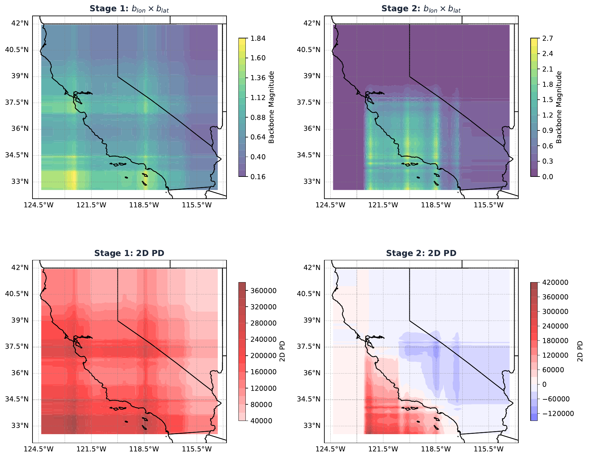
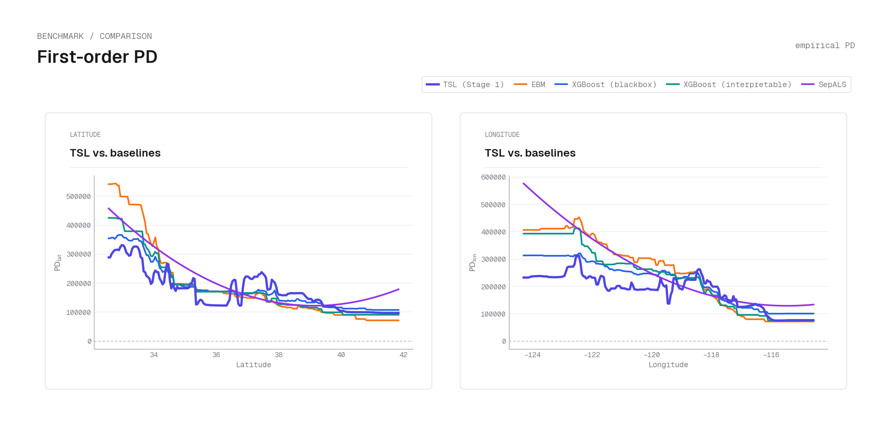

# TSL — Tensor Separation Learning 

[](https://opensource.org/licenses/MIT)
[](https://jyliuu.github.io/TSL/)


TSL is a glass-box regression model for learning rich interactions without sacrificing
interpretability. It represents predictions as a sum of stages, where each stage is a
difference of two separable products of univariate functions. This gives TSL expressive
interaction structure while keeping the model directly inspectable through its learned
feature-wise components.

📖 **Documentation:** [jyliuu.github.io/TSL](https://jyliuu.github.io/TSL/) — guides, the Python
& R API reference, and the under-the-hood math.

## Installation

### Rust toolchain

TSL's Python and R packages compile the Rust core at install time, so **a working Rust
toolchain is required first**. Install it with [rustup](https://rustup.rs) if Rust is not
already on your machine:

```sh
curl --proto '=https' --tlsv1.2 -sSf https://sh.rustup.rs | sh
```

### Install (Python)

The Python package is published on PyPI as **`tensorsl`** and imported under the same name:

```sh
pip install tensorsl

# optional extras
pip install "tensorsl[plots]"     # matplotlib for tensorsl.plot
pip install "tensorsl[examples]"  # EBM, XGBoost, SepALS for comparisons
```

Source builds compile the Rust extension at install time, so the Rust toolchain above is
required.

### Install (R)

The R package **`tensorsl`** lives in the `tsl-r/` subdirectory of this repository. Install
it from the repository root with either `pak` or `remotes`:

```r
# pak (owner/repo/subdir):
pak::pak("jyliuu/TSL/tsl-r")

# remotes / devtools:
remotes::install_github("jyliuu/TSL", subdir = "tsl-r")
```

The R build compiles the same Rust core at install time, so it uses the Rust toolchain from
above.

## Development install

This is a Cargo workspace (root crate `tsl_rust` + member `tsl-py`).

**Rust core** — always pass `--release` (the tests run numerical workloads; debug is far too
slow):

```sh
cargo build --release
cargo test -p tsl_rust --release                 # full core test suite
cargo test -p tsl_rust --release test_name        # a single test by name
```

**Python wrapper** — `maturin develop` builds the Rust extension and installs it into a
Python virtualenv. Point it at the project's venv by setting `VIRTUAL_ENV` (and invoking
that venv's `maturin`):

```sh
# from tsl-py/
VIRTUAL_ENV=/path/to/.venv /path/to/.venv/bin/maturin develop
/path/to/.venv/bin/python -m pytest python/tests/
```

**R package** — for local iteration against the working-tree core, add an untracked
`tsl-r/src/rust/.cargo/config.toml` with:

```toml
paths = ["../../.."]
```

Then install from the `tsl-r/` directory:

```r
devtools::install_local("tsl-r")
```

## Usage

```python
import numpy as np
from sklearn.model_selection import train_test_split
from tensorsl.sklearn import TSLRegressor

# Toy problem with a separable structure
rng = np.random.default_rng(0)
X = rng.uniform(0.0, 1.0, size=(1000, 2))
y = 2.0 * X[:, 1] + X[:, 0] - 0.5 * X[:, 0] * X[:, 1] + 3.0

X_train, X_test, y_train, y_test = train_test_split(X, y, test_size=0.2, random_state=0)

model = TSLRegressor(epochs=3, n_trees=4, n_iter=25, seed=1)
model.fit(X_train, y_train)

predictions = model.predict(X_test)
print(f"Test R^2: {model.score(X_test, y_test):.4f}")
```

The same toy problem in R — the `tensorsl` package mirrors the Python hyperparameters:

```r
library(tensorsl)

set.seed(1)
x <- matrix(runif(1000 * 2), ncol = 2)
y <- 2 * x[, 2] + x[, 1] - 0.5 * x[, 1] * x[, 2] + 3

fit <- tsl(x, y, epochs = 3L, n_trees = 4L, n_iter = 25L, seed = 1L, verbosity = 0L)
preds <- predict(fit, x)
cat(sprintf("Train R^2: %.4f\n", 1 - var(y - preds) / var(y)))
```

## Examples

The figures below are produced by the scripts in
[`tsl-py/examples/`](tsl-py/examples/), fitting on the OpenML California housing dataset
(target: median home value, USD). The snippets show the core
[`tensorsl.plot`](tsl-py/python/tensorsl/plot/) calls; the example scripts add paper styling
(a cartopy basemap for the spatial plots, and pretrained EBM/XGBoost models for the
comparison). Every plotting helper returns the figure **and** the underlying arrays, so
you can save it directly or rebuild a custom visualization.

First, fit a model:

```python
from sklearn.datasets import fetch_california_housing
from tensorsl import TSL

data = fetch_california_housing()
X = data.data
y = data.target
feature_names = list(data.feature_names)

# TSL.fit returns (model, fit_result)
model, _ = TSL.fit(X, y, epochs=5, n_trees=16, n_iter=30, split_try=16, seed=0)
```

### Feature importance

```python
from tensorsl.plot import plot_feature_importance

result = plot_feature_importance(model, X, feature_names=feature_names)
result.fig.savefig("feature_importance.png")
```


Per-stage importances aggregated across stages. Geography (Longitude, Latitude)
dominates, with the second-stage inland correction loaded primarily onto longitude.

### Local explanations

The prediction at a single point is a sum of stage contributions, each of which splits
into a magnitude and a signed direction. `plot_local_interpretation` shows, per stage,
the dollar contribution, the share of each feature in that stage's magnitude, and the
signed direction of each feature.

```python
import numpy as np
from tensorsl.plot import compute_local_explanation, plot_local_interpretation

lat, lon = feature_names.index("Latitude"), feature_names.index("Longitude")
# the blocks nearest two reference locations: the SF Bay (coastal) and Palm Springs (desert)
coastal = int(np.argmin(np.abs(X[:, lat] - 37.7) + np.abs(X[:, lon] + 122.4)))
desert = int(np.argmin(np.abs(X[:, lat] - 33.8) + np.abs(X[:, lon] + 116.5)))

for name, i in [("coastal", coastal), ("desert", desert)]:
    expl = compute_local_explanation(model, X[i])
    plot_local_interpretation(
        explanations=[expl], points=[X[i]], titles=[name.title()],
        feature_names=feature_names, save_path=f"local_{name}.png",
    )
```

A **coastal** observation (San Francisco Bay area, predicted ≈ \$174k):


A **desert** observation (low-density inland near Palm Springs, predicted ≈ \$111k):


At the coastal point Stage 1 alone supplies almost the entire prediction — the coastal
premium — and later stages add only small corrections. At the desert point Stage 1 still
leads but is weaker: the spatial gate is less active inland, and Longitude and Latitude
contribute a negative tilt rather than the coastal premium. This is the local view of how
the stages divide the spatial structure between them.

### Spatial structure

Each stage is a product of 1D factors, so its 2D partial dependence over
(longitude, latitude) is the product of the corresponding 1D factors. The magnitude of
that product — the stage's **backbone** — acts as a spatial gate: where the backbone is
near zero, the stage is silent.

```python
from tensorsl.plot import plot_2d_backbone

result = plot_2d_backbone(
    model, X, "Longitude", "Latitude",
    feature_names=feature_names, stages=[0, 1],
)
result.fig.savefig("spatial_backbone.png")
```



*Top row:* backbone (magnitude). *Bottom row:* signed 2D partial dependence in USD. The
first stage fires along the coast, encoding the coastal premium. Because the stage is
separable, it also over-predicts at inland points that happen to fall under both a
longitude peak and a latitude peak; the second stage gates onto exactly those regions and
cancels the artifact. (The figure above overlays a California basemap via cartopy — see
[`california.py`](tsl-py/examples/california.py).)

### Partial dependence vs. other models

Because a TSL stage factor is itself a 1D function, its partial dependence keeps sharp
local structure. Tree ensembles and EBMs express geography through a joint
(latitude, longitude) surface, so the marginal partial dependence on one coordinate
averages over the other and smooths localized peaks away. You can pull TSL's own 1D
partial dependence with:

```python
from tensorsl.plot import plot_first_order_pd

result = plot_first_order_pd(model, X, features=["Latitude", "Longitude"],
                             feature_names=feature_names)
result.fig.savefig("pd.png")
```

The figure below overlays TSL (Stage 1) against EBM, XGBoost, and
[SepALS](https://github.com/jyliuu/sepals) — produced by
[`california.py`](tsl-py/examples/california.py), which loads the pretrained comparison
models.



TSL retains the sharp local structure near LA, SF, and the Bay Area that the other models
smooth away.

## Rust

The Python package wraps a standalone Rust crate, which can be used directly:

```rust
use tsl::forest::{fit_boosted, params::TSLBoostedParamsBuilder};
use tsl::grid_tensor::params::SplitStrategyParams;
use ndarray::{Array1, Array2};

fn main() {
    let x: Array2<f64> = /* your features  */ ;
    let y: Array1<f64> = /* your targets   */ ;

    let params = TSLBoostedParamsBuilder::new()
        .epochs(40)
        .n_iter(120)
        .n_trees(4)
        .split_strategy(SplitStrategyParams::RandomSplit {
            split_try: 12,
            colsample_bytree: 1.0,
        })
        .seed(42)
        .build();

    let (_fit_result, model) = fit_boosted(x.view(), y.view(), &params);
    let predictions = model.predict(x.view());
}
```

## R

The `tensorsl` package ([`tsl-r/`](tsl-r/)) wraps the same Rust core for R through
[extendr](https://extendr.github.io/), exposing an S3 `fit`/`predict` interface plus a native
ggplot2 interpretability layer. Install it from the `tsl-r/` subdirectory:

```r
pak::pak("jyliuu/TSL/tsl-r")

library(tensorsl)

set.seed(1)
x <- matrix(runif(500 * 3, -2, 2), ncol = 3, dimnames = list(NULL, c("a", "b", "c")))
y <- 2 * x[, 1] - x[, 2] + 0.5 * x[, 3] + rnorm(500, sd = 0.1)

fit <- tsl(x, y, epochs = 20L, seed = 42L)
preds <- predict(fit, x)

# inspect the glass box and draw the diagnostics
comp <- tsl_components(fit)
ggplot2::autoplot(fit, type = "pd")
```

The hyperparameters mirror the Python `TSLRegressor`, so a fit with the same data and `seed`
reproduces the Python results. See the [R API documentation](https://jyliuu.github.io/TSL/code/r-api/)
and the [`tsl-r/` README](tsl-r/README.md).

## Documentation

Full reference documentation is hosted at **[jyliuu.github.io/TSL](https://jyliuu.github.io/TSL/)**:

- **[Getting started](https://jyliuu.github.io/TSL/guides/getting-started/)** — install, fit, and inspect a model end to end.
- **[Python API](https://jyliuu.github.io/TSL/code/python-api/)** & **[Plotting API](https://jyliuu.github.io/TSL/code/plotting/)** — the `TSLRegressor` and `tensorsl.plot` reference.
- **[R API](https://jyliuu.github.io/TSL/code/r-api/)** — the `tensorsl` S3 interface and ggplot2 layer.
- **[Hyperparameters](https://jyliuu.github.io/TSL/guides/hyperparameters/)** — every fit parameter, explained.
- **[Under the hood](https://jyliuu.github.io/TSL/math/)** — the model, fitting, bagging, and partial-dependence math.

The rest of this section summarizes the model.

## The model

For inputs $\mathbf{x} = (x\_1, \dots, x\_p)$, a fitted TSL estimator with $R$ stages has
the form

$$
\hat{m}(\mathbf{x}) = \sum_{\ell=1}^{R} \left( \lambda_{+}^{(\ell)} \prod_{j=1}^{p} \hat{m}_{+,j}^{(\ell)}(x_j) - \lambda_{-}^{(\ell)} \prod_{j=1}^{p} \hat{m}_{-,j}^{(\ell)}(x_j) \right),
$$

$$
\hat{m}_{+,j}^{(\ell)}(x_j) > 0, \quad \hat{m}_{-,j}^{(\ell)}(x_j) > 0, \quad \lambda_{+}^{(\ell)} \ge 0, \quad \lambda_{-}^{(\ell)} \ge 0.
$$

Each stage is a **difference of two strictly positive rank-1 products**, scaled by
non-negative stage coefficients. Forcing every component function to be *strictly
positive* — never zero — removes the sign ambiguity that destabilizes unconstrained
tensor decompositions: each component then unambiguously amplifies or suppresses its
product, so its value faithfully reflects a directional role. Signed contributions still
arise, through cancellation between the two products in the ordered difference.

Because both branch factors are strictly positive, each pair
$(\hat{m}\_{+,j}^{(\ell)}, \hat{m}\_{-,j}^{(\ell)})$ has a unique **backbone / exponential-tilt**
form: a strictly positive **backbone** $b\_j^{(\ell)}(x\_j) > 0$ carrying their shared
magnitude (geometric mean) and an unconstrained **tilt** $d\_j^{(\ell)}(x\_j) \in \mathbb{R}$
carrying their signed imbalance (half-log ratio),

$$
\hat{m}_{\pm,j}^{(\ell)}(x_j) = b_j^{(\ell)}(x_j)\, e^{\pm d_j^{(\ell)}(x_j)}, \qquad b_j^{(\ell)} = \sqrt{\hat{m}_{+,j}^{(\ell)}\,\hat{m}_{-,j}^{(\ell)}}, \qquad d_j^{(\ell)} = \tfrac{1}{2}\log\frac{\hat{m}_{+,j}^{(\ell)}}{\hat{m}_{-,j}^{(\ell)}}.
$$

Absorbing the stage scalars the same way — $b\_0^{(\ell)} = \sqrt{\lambda\_+^{(\ell)}\,\lambda\_-^{(\ell)}}$
and $d\_0^{(\ell)} = \tfrac{1}{2}\log(\lambda\_+^{(\ell)}/\lambda\_-^{(\ell)})$ — the per-feature
backbones **multiply** and the per-feature tilts **add**, so the whole estimator is
equivalently a sum of backbones times an odd function of the tilt:

$$
b^{(\ell)}(\mathbf{x}) = b_0^{(\ell)} \prod_{j=1}^{p} b_j^{(\ell)}(x_j) > 0, \qquad d^{(\ell)}(\mathbf{x}) = d_0^{(\ell)} + \sum_{j=1}^{p} d_j^{(\ell)}(x_j) \in \mathbb{R},
$$

$$
\hat{m}(\mathbf{x}) = 2 \sum_{\ell=1}^{R} b^{(\ell)}(\mathbf{x}) \sinh(d^{(\ell)}(\mathbf{x})).
$$

The backbone $b^{(\ell)}(\mathbf{x}) > 0$ is the stage's **magnitude**, and acts as an
activity gate: the per-feature backbones multiply, so a near-zero factor in any feature
switches the stage off there, while large factors make it active. Being strictly positive
it never cancels — even where the stage's signed contribution crosses zero, the magnitude
stays recoverable. The tilt $d^{(\ell)}(\mathbf{x}) \in \mathbb{R}$ is the stage's **signed
direction**, entering through the strictly increasing odd function $\sinh$: raising the
tilt always raises the stage contribution, positive tilt leans toward the $(+)$ product
and negative toward the $(-)$, and zero tilt means the two branches balance (no
contribution). Since the per-feature tilts simply add, each $d\_j^{(\ell)}$ reads as an
additive imbalance score. The [Examples](#examples) visualize the backbone and tilt
directly.

This is the central difference from additive models. GAMs and GA²M decompose $m$ as a sum
of low-dimensional shape functions $m\_j(x\_j) + \sum\_{j<k} m\_{jk}(x\_j, x\_k) + \cdots$
and pay for higher-order interactions one term at a time; SHAP and functional ANOVA
likewise distribute a prediction additively across features. TSL instead captures
interactions through the *multiplicative* structure of each stage — a single rank-1
product already binds all $p$ features together.
## License

MIT License — see [LICENSE](LICENSE).
