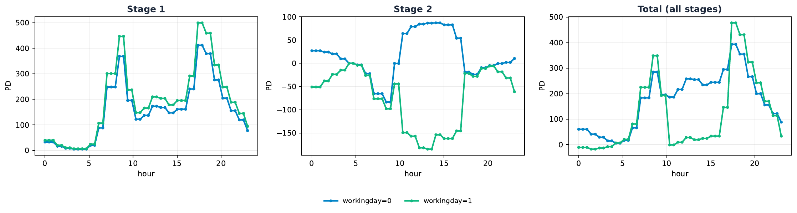

# Plotting (`tsl_py.plot`)

`tsl_py.plot` holds the diagnostic plots. It is **lazy-imported** (it needs `matplotlib`,
installed via the `[plots]` extra) so importing `tsl_py` stays light.

```python
import tsl_py.plot as tplot
```

!!! tip "Figure **and** data"
    Every helper returns a **result dataclass carrying the raw arrays** in addition to
    drawing the figure, so you can re-style, export, or rebuild a custom visualization.

### Common parameters

Most plotting functions share these; per-function tables below list only the distinctive
ones.

| Parameter | Type | Default | Description |
|------|------|:--:|-------------|
| `model` | `TSL` | _required_ | a fitted model (`TSLRegressor.core_estimator_`) |
| `X` | `ndarray (n_samples, n_features)` | _required_ | background data to marginalize over |
| `features` | `Iterable[int \| str] \| None` | `None` | features to plot (default: all) |
| `feature_x`, `feature_y` | `int \| str` | _required_ | the two features for 2D plots |
| `feature_names` | `Sequence[str] \| None` | `None` | names for labelling |
| `stages` | `Iterable[int] \| None` | `None` | which stages to draw (default: all) |
| `grid_points` | `int` | `200`/`100`/`50` | evaluation resolution |
| `figsize` | `tuple[float, float] \| None` | `None` | matplotlib figure size |

---

## Partial dependence & ICE

### `plot_first_order_pd` { #fn-plot-first-order-pd }

```python
plot_first_order_pd(model, X, features=None, feature_names=None, grid_points=200,
                    stages=None, figsize=None, pd_scale="raw",
                    show_data_density=False) -> PDDifferenceResult
```

First-order partial dependence — the $f_+$ and $f_-$ branch curves — per stage for the
selected features (one row per stage, one column per feature).

| Parameter | Type | Default | Description |
|------|------|:--:|-------------|
| `pd_scale` | `"raw" \| ...` | `"raw"` | scaling applied to the PD curves |
| `show_data_density` | `bool` | `False` | overlay a data-density rug |

**Returns**

| Type | Description |
|------|-------------|
| `PDDifferenceResult` | figure plus the per-stage f₊/f₋ branch curves and constants for the selected features. |

### `pd_difference_plot` { #fn-pd-difference-plot }

```python
pd_difference_plot(model, X, features=None, feature_names=None, grid_points=200,
                   stages=None, show_backbone_overlay=True, show_global=False,
                   figsize=None, pd_scale="raw", show_data_density=False)
                   -> PDDifferenceResult
```

The signed PD difference $\mathrm{PD}_+ - \mathrm{PD}_-$ with the $\sqrt{C_+ C_-}\,b_j$
**backbone overlay** (dotted). The workhorse 1D interpretation plot.

| Parameter | Type | Default | Description |
|------|------|:--:|-------------|
| `show_backbone_overlay` | `bool` | `True` | draw the dotted backbone overlay |
| `show_global` | `bool` | `False` | also draw the summed-over-stages curve |

**Returns**

| Type | Description |
|------|-------------|
| `PDDifferenceResult` | figure plus the per-stage signed-PD arrays, constants, and (if `pd_scale="component"`) normalized diagnostics. |

### `plot_2d_pd` { #fn-plot-2d-pd }

```python
plot_2d_pd(model, X, feature_x, feature_y, feature_names=None, grid_points=50,
           kind="surface", y_values=None, stages=None, cmap=None, figsize=None)
           -> PD2DResult | PD2DLinesResult
```

Two-feature partial dependence per stage.

| Parameter | Type | Default | Description |
|------|------|:--:|-------------|
| `kind` | `str` | `"surface"` | `"surface"` or `"lines"` |
| `y_values` | `Sequence[float] \| None` | `None` | (for `"lines"`) values of `feature_y` to slice at |
| `cmap` | `Colormap \| None` | `None` | colormap |

**Returns**

| Type | Description |
|------|-------------|
| `PD2DResult \| PD2DLinesResult` | `PD2DResult` when `kind="surface"`, `PD2DLinesResult` when `kind="lines"`. |

<figure markdown="span">
  { width="75%" }
  <figcaption><code>plot_2d_pd(..., kind="lines")</code> on bike-sharing.</figcaption>
</figure>

### `plot_ice` { #fn-plot-ice }

```python
plot_ice(model, X, feature, feature_names=None, n_ice=50, grid_points=100,
         seed=0, ax=None, figsize=(7, 4)) -> ICEResult
```

Individual Conditional Expectation curves for one feature.

| Parameter | Type | Default | Description |
|------|------|:--:|-------------|
| `feature` | `int \| str` | _required_ | feature to vary |
| `n_ice` | `int` | `50` | number of observations sampled |
| `seed` | `int` | `0` | sampling seed |
| `ax` | `Axes \| None` | `None` | draw onto an existing axis |

**Returns**

| Type | Description |
|------|-------------|
| `ICEResult` | figure plus the ICE matrix and the average PD curve. |

---

## Backbone & tilt

### `plot_2d_backbone` { #fn-plot-2d-backbone }

```python
plot_2d_backbone(model, X, feature_x, feature_y, feature_names=None, stages=None,
                 grid_points=100, cmap_backbone=None, cmap_pd=None, figsize=None,
                 return_data_only=False) -> Backbone2DResult
```

The 2D backbone product $b_x\cdot b_y$ and the 2D PD per stage — the generic "spatial
backbone" plot. Returns the meshgrid and per-stage arrays so callers can overlay e.g.
cartopy.

| Parameter | Type | Default | Description |
|------|------|:--:|-------------|
| `cmap_backbone`, `cmap_pd` | `Colormap \| None` | `None` | colormaps for each panel |
| `return_data_only` | `bool` | `False` | skip drawing; return arrays only |

**Returns**

| Type | Description |
|------|-------------|
| `Backbone2DResult` | figure (or `None` if `return_data_only=True`) plus the meshgrid and per-stage backbone-product and 2D-PD arrays. |

<figure markdown="span">
  { width="100%" }
  <figcaption><code>plot_2d_backbone</code> on California latitude × longitude (cartopy basemap added by the example).</figcaption>
</figure>

### `plot_tilt_1d` { #fn-plot-tilt-1d }

```python
plot_tilt_1d(model, X, features=None, feature_names=None, grid_points=200,
             stages=None, figsize=None, color=None) -> Tilt1DResult
```

The per-feature, per-stage tilt $d_j(x_j)$ as step curves (layout mirrors
`plot_first_order_pd`), with a zero reference line.

| Parameter | Type | Default | Description |
|------|------|:--:|-------------|
| `color` | `str \| None` | `None` | step-curve color (default: a violet accent) |

**Returns**

| Type | Description |
|------|-------------|
| `Tilt1DResult` | figure plus the per-feature, per-stage tilt step-curve arrays. |

### `plot_2d_tilt` { #fn-plot-2d-tilt }

```python
plot_2d_tilt(model, X, feature_x, feature_y, feature_names=None, stages=None,
             grid_points=100, cmap=None, figsize=None, return_data_only=False)
             -> Tilt2DResult
```

The 2D tilt product $d_x(x)\cdot d_y(y)$ per stage.

| Parameter | Type | Default | Description |
|------|------|:--:|-------------|
| `cmap` | `Colormap \| str \| None` | `None` | diverging colormap (default: the package pink↔white↔emerald) |
| `return_data_only` | `bool` | `False` | skip drawing; return arrays only (`fig`/`axes` are `None`) |

**Returns**

| Type | Description |
|------|-------------|
| `Tilt2DResult` | figure plus the meshgrid and per-stage 2D tilt-product arrays. |

### `plot_tilt_diagnostics` { #fn-plot-tilt-diagnostics }

```python
plot_tilt_diagnostics(model, X, features=None, feature_names=None, grid_points=200,
                      stages=None, figsize=None, pure_color=None,
                      weighted_color=None) -> TiltDiagnosticsResult
```

Exploratory tilt diagnostics — four curves per `(stage, feature)` cell (pure vs.
density-weighted tilt).

| Parameter | Type | Default | Description |
|------|------|:--:|-------------|
| `pure_color` | `str \| None` | `None` | color for the two `tanh`-only panels (default: sky blue) |
| `weighted_color` | `str \| None` | `None` | color for the two backbone-weighted panels (default: emerald) |

**Returns**

| Type | Description |
|------|-------------|
| `TiltDiagnosticsResult` | figure plus the four diagnostic curve arrays per (feature, stage). |

---

## Feature importance

### `plot_feature_importance` { #fn-plot-feature-importance }

```python
plot_feature_importance(model, X, feature_names=None, gamma=1.0,
                        figsize=(14, 10)) -> FeatureImportanceResult
```

A six-panel summary: per-stage backbone and tilt importance (heatmaps), global backbone and
tilt importance (bars), the combined $I_j = I_j^b + \gamma\, I_j^d$ (bar), and energy-based
stage weights (bar).

| Parameter | Type | Default | Description |
|------|------|:--:|-------------|
| `gamma` | `float` | `1.0` | weight on the tilt component in the combined score |

**Returns**

| Type | Description |
|------|-------------|
| `FeatureImportanceResult` | figure plus the per-stage, global, and combined backbone/tilt importance arrays and stage weights. |

<figure markdown="span">
  { width="100%" }
  <figcaption><code>plot_feature_importance</code> on California housing.</figcaption>
</figure>

---

## Local (per-observation) interpretation

### `compute_local_explanation` { #fn-compute-local-explanation }

```python
compute_local_explanation(model, x) -> LocalExplanation
```

Per-stage decomposition of a single prediction: the $f_+/f_-$ contributions, per-feature
backbone/tilt values, and the intercept $(b_0, d_0)$ absorbing the OLS scaling.

| Parameter | Type | Default | Description |
|------|------|:--:|-------------|
| `model` | `TSL` | _required_ | fitted model |
| `x` | `ndarray (n_features,)` | _required_ | the single point to explain |

**Returns**

| Type | Description |
|------|-------------|
| `LocalExplanation` | per-stage decomposition of one prediction (no figure). |

### `plot_local_interpretation` { #fn-plot-local-interpretation }

```python
plot_local_interpretation(explanations, points, titles, feature_names, save_path,
                          top_k_features=3, point_value_formatter=None,
                          units_label="Contribution to prediction",
                          prediction_format=<callable>, header=True) -> object
```

The three-column "Backbone × Tilt" local-interpretation plot — one column per point, rows =
stages sorted by absolute net contribution.

| Parameter | Type | Default | Description |
|------|------|:--:|-------------|
| `explanations` | `list[LocalExplanation]` | _required_ | from `compute_local_explanation` |
| `points` | `list[ndarray]` | _required_ | the explained points |
| `titles` | `list[str]` | _required_ | per-column titles |
| `feature_names` | `Sequence[str]` | _required_ | feature labels |
| `save_path` | `Path` | _required_ | output path |
| `top_k_features` | `int` | `3` | features shown per stage row |

**Returns**

| Type | Description |
|------|-------------|
| `matplotlib.figure.Figure` | the assembled three-column figure. |

<figure markdown="span">
  { width="49%" }
  { width="49%" }
  <figcaption><code>plot_local_interpretation</code> for a coastal vs. an inland point.</figcaption>
</figure>

---

## Component plots

### `plot_grid_tensor_components` { #fn-plot-grid-tensor-components }

```python
plot_grid_tensor_components(grid_tensor, individual_plots=False, axis=None) -> None
```

Plot a single `GridTensor`'s backbone/tilt component curves.

| Parameter | Type | Default | Description |
|------|------|:--:|-------------|
| `grid_tensor` | `GridTensor` | _required_ | the component to plot |
| `individual_plots` | `bool` | `False` | one figure per axis vs. a combined grid |
| `axis` | `int \| None` | `None` | restrict to a single feature axis |

**Returns**

| Type | Description |
|------|-------------|
| `None` | draws onto the current/given axis; returns nothing. |

### `plot_combined_grid_tensors` { #fn-plot-combined-grid-tensors }

```python
plot_combined_grid_tensors(model, individual_plots=True, axis=None) -> None
```

Overlay the combined grid-tensor components across a model's stages.

| Parameter | Type | Default | Description |
|------|------|:--:|-------------|
| `individual_plots` | `bool` | `True` | one figure per axis vs. a combined grid |
| `axis` | `int \| None` | `None` | restrict to a single feature axis |

**Returns**

| Type | Description |
|------|-------------|
| `None` | draws one figure per stage; returns nothing. |

### `plot_epoch_components` { #fn-plot-epoch-components }

```python
plot_epoch_components(model, epoch) -> None
```

Plot the per-feature components for one stage/epoch.

| Parameter | Type | Default | Description |
|------|------|:--:|-------------|
| `epoch` | `int` | _required_ | the stage/epoch index |

**Returns**

| Type | Description |
|------|-------------|
| `None` | draws one figure per component; returns nothing. |

---

## Result dataclasses

Each plotting function returns a small dataclass exposing the underlying arrays, so you can export the numbers or build a bespoke figure without recomputing:

### `PDDifferenceResult` { #dc-pddifferenceresult }

Returned by `plot_first_order_pd` and `pd_difference_plot`.

| Field | Type | Description |
|------|------|-------------|
| `fig` | `Figure` | the drawn figure |
| `axes` | `ndarray of Axes (n_stages, n_features)` | one cell per (stage, feature) |
| `feature_indices` | `list[int]` | plotted feature columns |
| `feature_names` | `list[str]` | their labels |
| `x_grids` | `list[ndarray (n_grid,)]` | evaluation grid per feature |
| `f_plus` | `ndarray (n_features, n_grid, n_stages)` | scaled f₊ branch curves |
| `f_minus` | `ndarray (n_features, n_grid, n_stages)` | scaled f₋ curves; carries the model's negative sign, so the positive PD₋ = −`f_minus` |
| `constants` | `ndarray (n_features, n_stages, 2)` | (c₊, c₋) per (feature, stage); c₋ stored with model sign, so C₋ = −c₋ |
| `pd_scale` | `str` | `"raw"` or `"component"` |
| `normalized` | `NormalizedDiagnostics \| None` | populated only when `pd_scale="component"` |

### `NormalizedDiagnostics` { #dc-normalizeddiagnostics }

Component-space (m-space) diagnostics carried on a `PDDifferenceResult`; present only when `pd_scale="component"`. Every array has shape `(n_features, n_grid, n_stages)`.

| Field | Type | Description |
|------|------|-------------|
| `m_plus` | `ndarray` | PD₊ / C₊ (positive component factor) |
| `m_minus` | `ndarray` | PD₋ / C₋ |
| `backbone` | `ndarray` | √(m₊·m₋), the intrinsic per-feature backbone |
| `tilt` | `ndarray` | ½·log(m₊/m₋), the intrinsic per-feature tilt |
| `tilt_centered` | `ndarray` | `tilt` minus its mean over the x-grid |
| `tilt_score` | `ndarray` | tanh(`tilt_centered`) |

### `PD2DResult` { #dc-pd2dresult }

Returned by `plot_2d_pd(kind="surface")`.

| Field | Type | Description |
|------|------|-------------|
| `fig` | `Figure` | the drawn figure |
| `axes` | `ndarray of Axes` | the surface panels |
| `feature_x`, `feature_y` | `int` | the two plotted feature columns |
| `x_vals`, `y_vals` | `ndarray` | the two coordinate axes |
| `X`, `Y` | `ndarray` | meshgrid coordinates |
| `pd_total` | `ndarray` | summed-over-stages 2D PD |
| `pd_per_stage` | `ndarray (n_stages, len(y), len(x))` | per-stage 2D PD |

### `PD2DLinesResult` { #dc-pd2dlinesresult }

Returned by `plot_2d_pd(kind="lines")`.

| Field | Type | Description |
|------|------|-------------|
| `fig` | `Figure` | the drawn figure |
| `axes` | `ndarray of Axes` | the line panels |
| `feature_x`, `feature_y` | `int` | the two plotted feature columns |
| `x_vals` | `ndarray` | the swept coordinate axis |
| `y_values` | `ndarray` | the chosen (or unique) values of `feature_y`, one line each |
| `pd_per_stage` | `ndarray (n_stages, len(y_values), len(x_vals))` | per-stage 1D PD per `feature_y` slice |

### `ICEResult` { #dc-iceresult }

Returned by `plot_ice`.

| Field | Type | Description |
|------|------|-------------|
| `fig` | `Figure` | the drawn figure |
| `ax` | `Axes` | the ICE panel |
| `feature_index` | `int` | the varied feature column |
| `x_grid` | `ndarray` | swept values |
| `ice` | `ndarray (n_obs, len(x_grid))` | one ICE curve per sampled observation |
| `pd` | `ndarray (len(x_grid),)` | the average (PD) curve |

### `Backbone2DResult` { #dc-backbone2dresult }

Returned by `plot_2d_backbone`.

| Field | Type | Description |
|------|------|-------------|
| `fig` | `Figure \| None` | `None` when `return_data_only=True` |
| `axes` | `ndarray of Axes (2, n_stages) \| None` | row 0 backbone-product panels, row 1 2D-PD panels |
| `feature_x`, `feature_y` | `int` | the two plotted feature columns |
| `x_vals`, `y_vals` | `ndarray (grid_points,)` | coordinate axes |
| `X`, `Y` | `ndarray (grid_points, grid_points)` | meshgrid |
| `backbone_per_stage` | `ndarray (n_stages, grid_points, grid_points)` | per-stage product bₓ(x)·b_y(y) |
| `pd_per_stage` | `ndarray (n_stages, grid_points, grid_points)` | per-stage 2D PD (f₊ + f₋) |
| `stages` | `list[int]` | stage indices included |

### `Tilt1DResult` { #dc-tilt1dresult }

Returned by `plot_tilt_1d`.

| Field | Type | Description |
|------|------|-------------|
| `fig` | `Figure` | the drawn figure |
| `axes` | `ndarray of Axes (n_stages, n_features)` | one cell per (stage, feature) |
| `feature_indices` | `list[int]` | plotted feature columns |
| `feature_names` | `list[str]` | their labels |
| `x_grids` | `list[ndarray (grid_points,)]` | evaluation grid per feature |
| `tilt` | `ndarray (n_features, grid_points, n_stages)` | evaluated tilt dⱼ(xⱼ) per stage |

### `Tilt2DResult` { #dc-tilt2dresult }

Returned by `plot_2d_tilt`.

| Field | Type | Description |
|------|------|-------------|
| `fig` | `Figure \| None` | `None` when `return_data_only=True` |
| `axes` | `ndarray of Axes \| None` | the tilt panels |
| `feature_x`, `feature_y` | `int` | the two plotted feature columns |
| `x_vals`, `y_vals` | `ndarray` | the two coordinate axes |
| `X`, `Y` | `ndarray (grid_points, grid_points)` | meshgrid |
| `tilt_per_stage` | `ndarray (n_stages, grid_points, grid_points)` | per-stage product dₓ(x)·d_y(y) |
| `stages` | `list[int]` | stage indices included |

### `TiltDiagnosticsResult` { #dc-tiltdiagnosticsresult }

Returned by `plot_tilt_diagnostics`.

| Field | Type | Description |
|------|------|-------------|
| `fig` | `Figure` | the drawn figure |
| `axes` | `ndarray of Axes (n_features·n_stages, 4)` | row `f·n_stages+s` holds the four curves for (feature f, stage s) |
| `feature_indices` | `list[int]` | plotted feature columns |
| `feature_names` | `list[str]` | their labels |
| `stages` | `list[int]` | stage indices included |
| `x_grids` | `list[ndarray (grid_points,)]` | evaluation grid per feature |
| `B` | `ndarray (n_features, grid_points, n_stages)` | intrinsic backbone √(m₊·m₋) |
| `d` | `ndarray (n_features, grid_points, n_stages)` | intrinsic tilt ½·log(m₊/m₋) |
| `d_centered` | `ndarray (same shape as d)` | `d` minus its mean over the grid |
| `curves` | `ndarray (n_features, grid_points, n_stages, 4)` | the four plotted curves stacked last: [tanh(d), B·tanh(d), tanh(d_centered), B·tanh(d_centered)] |

### `LocalExplanation` { #dc-localexplanation }

Returned by `compute_local_explanation`; the per-stage decomposition of a single prediction (intercept treated as axis j=0).

| Field | Type | Description |
|------|------|-------------|
| `stage_contributions` | `ndarray (n_stages,)` | net signed contribution per stage |
| `f_plus_contributions` | `ndarray (n_stages,)` | scaling_plus · f₊ |
| `f_minus_contributions` | `ndarray (n_stages,)` | −scaling_minus · f₋ |
| `backbone_magnitudes` | `ndarray (n_stages,)` | ∏ⱼ bⱼ(xⱼ) over j=1..p |
| `tilt_sums` | `ndarray (n_stages,)` | Σⱼ dⱼ(xⱼ) over j=1..p |
| `feature_backbone` | `ndarray (n_stages, n_features)` | per-stage, per-feature backbone bⱼ(xⱼ) |
| `feature_tilt` | `ndarray (n_stages, n_features)` | per-stage, per-feature tilt dⱼ(xⱼ) |
| `intercept_backbone` | `ndarray (n_stages,)` | b₀ = √(eff_λ₊·eff_λ₋) |
| `intercept_tilt` | `ndarray (n_stages,)` | d₀ = ½·log(eff_λ₊/eff_λ₋) |
| `total_prediction` | `float` | the model's prediction at the point |

### `FeatureImportanceResult` { #dc-featureimportanceresult }

Returned by `plot_feature_importance`.

| Field | Type | Description |
|------|------|-------------|
| `fig` | `Figure` | the drawn figure |
| `axes` | `ndarray of Axes` | the six panels |
| `feature_names` | `list` | feature labels |
| `backbone_per_stage` | `ndarray (n_stages, n_features)` | per-stage backbone importance |
| `tilt_per_stage` | `ndarray (n_stages, n_features)` | per-stage tilt importance |
| `global_backbone` | `ndarray (n_features,)` | global backbone importance |
| `global_tilt` | `ndarray (n_features,)` | global tilt importance |
| `combined` | `ndarray (n_features,)` | Iⱼ = Iⱼᵇ + γ·Iⱼᵈ |
| `combined_backbone` | `ndarray (n_features,)` | backbone term Iⱼᵇ of the combined score |
| `combined_tilt` | `ndarray (n_features,)` | tilt term Iⱼᵈ of the combined score |
| `stage_weights` | `ndarray (n_stages,)` | energy-based per-stage weights |
